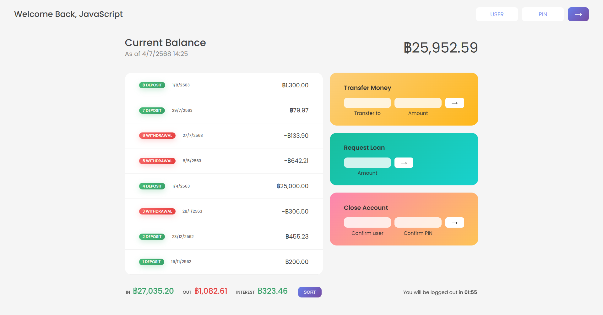

# 🏦 Bankist App

A sleek and responsive **banking interface** built entirely with **vanilla JavaScript** — featuring real-time balance updates, transaction tracking, money transfers, and a simulated loan system.

> This project was created as part of a hands-on learning journey to deepen understanding of DOM manipulation, array methods, and frontend state management.

---

## 🌐 Live Demo

👉 [**Try the App**](https://nkieu-bankist-app.vercel.app/)

---

## 📸 Screenshots



---

## ✨ Features

- 🔐 **User Authentication**
  Log in securely using a username and 4-digit PIN.

- 💼 **Real-Time Balance & Transactions**
  View a running balance, deposits, withdrawals, and transaction history.

- 🔄 **Instant Money Transfers**
  Simulate bank transfers between demo accounts.

- 💸 **Loan Request System**
  Apply for a loan with automatic eligibility checks and a realistic delay.

- 📊 **Sorted Transactions**
  Toggle between chronological and ascending-sorted views.

- ⏱️ **Auto Logout Timer**
  Ensures session security by logging out after 2 minutes of inactivity.

- 📅 **Localized Date & Currency Formatting**
  Transactions are formatted based on each user’s locale and currency.

---

## 🧪 Demo Accounts

| Username | PIN  | Account Owner      |
| -------- | ---- | ------------------ |
| `js`     | 1111 | JavaScript Student |
| `jd`     | 2222 | John Doe           |

> Use one of these accounts to explore app features.

---

## 🛠️ Tech Stack

| Technology            | Description                                     |
| --------------------- | ----------------------------------------------- |
| **HTML5**             | Semantic structure                              |
| **CSS3**              | Responsive layout and styling                   |
| **JavaScript (ES6+)** | Core logic, DOM manipulation, UI state handling |
| **Intl API**          | Locale-aware date and currency formatting       |
| **JavaScript Timers** | Implemented auto-logout countdown feature       |

---

## 📚 What I Learned

This project reinforced key JavaScript concepts, including:

- ✅ **DOM manipulation** and event delegation
- ✅ Advanced **array methods**: `map`, `filter`, `reduce`, `sort`, `find`, etc.
- ✅ **Stateful UI** updates and data flow handling
- ✅ Working with **dates** and formatting using `Intl.DateTimeFormat`
- ✅ Simulating real banking features with clean and maintainable code

---

## 🚀 Getting Started

### 🖥️ Run Locally

```bash
git clone https://github.com/nkieu-config/bankist-app-project.git
```

Then simply open `index.html` in your browser.

> ✅ No frameworks or build tools needed — just HTML, CSS, and JavaScript.

---

## 💡 How to Use

1. **Log in** with a demo username and PIN.
2. **Explore your account**: View all transactions and your current balance.
3. **Transfer money** to other demo users.
4. **Request a loan** if you meet the eligibility condition (≥10% of the loan already in your account).
5. **Sort transactions** using the sort button.
6. **Stay secure**: Auto-logout happens after 2 minutes of inactivity.

---

## 📘 Project Source

Built as part of:
🎓 [_The Complete JavaScript Course_](https://www.udemy.com/course/the-complete-javascript-course/)
by [Jonas Schmedtmann](https://codingheroes.io)

---

## ⚠️ Disclaimer

This is a **practice project** built for learning purposes only.
It is not intended for production or real-world banking.

---

## 📌 License

This project is open-source and available under the [MIT License](LICENSE).
